EDA
================

## 1\. 분석을 위한 기본적인 데이터 전처리

### 1\) 분석에 용이하도록 object 변수 변환

  - 학교 학생수를 숫자형으로 변환
  - area에서 숫자가 아닌 부분 제거
  - ’school\_addr\_town’에서 \~길의 내용을 제거하고 \~로까지 확인한다

<!-- end list -->

``` python
df['school_students'] = pd.to_numeric(df['school_students'])
```

``` python
# area에서 숫자가 아닌 부분을 제거해준다 
import re
df['area'] = df['area'].apply(lambda x: int(re.split('\D',x)[0]))
```

``` python
import re
df['school_addr_town'] = df['school_addr_town'].apply(lambda x: re.split('\d',x)[0])
df['school_addr_town'] = df['school_addr_town'].apply(lambda x: x.replace('로','동'))
```

### 2\) null값 확인

  - 학교 학생수에 null값이 발생하였고, 0의 값으로 대체

<!-- end list -->

``` python
df = df.fillna(0)
```

### 3\) 이상치 제거

  - 실거래가를 자치구별로 나누고 이상치 제거
  - 동일 면적의 아파트 거래가 한번인 경우, 해당 이상치는 제거하지 않았다

<!-- end list -->

``` python
#이상치 제거
df.drop(df[df['district_id']==2].sort_values(by='amount',ascending=False).head(1).index,inplace=True)
df.drop(df[df['district_id']==6].sort_values(by='amount',ascending=False).head(1).index,inplace=True)
df.drop(df[df['district_id']==12].sort_values(by='amount',ascending=False).head(5).index,inplace=True)
#df.drop(df[df['district_id']==13].sort_values(by='amount',ascending=False).head(2).index,inplace=True) 거래가 총 2번 이루어져서 제거 안함
df.drop(df[df['district_id']==14].sort_values(by='amount',ascending=False).head(1).index,inplace=True)
df.drop(df[df['district_id']==16].sort_values(by='amount',ascending=False).head(1).index,inplace=True)
df.drop(df[df['district_id']==18].sort_values(by='amount',ascending=False).head(1).index,inplace=True)
df.drop(df[df['district_id']==19].sort_values(by='amount',ascending=False).head(1).index,inplace=True)
df.drop(df[df['district_id']==22].sort_values(by='amount',ascending=False).head(3).index,inplace=True)#신호아파트 면적97인 아파트의 경우 한번 거래가 이루어져 제거 안함
df.drop(df[df['district_id']==24].sort_values(by='amount',ascending=False).head(1).index,inplace=True)
```

## 2\. 아파트 별 거래분포 확인

  - 시계열기법을 사용하기 이전에 각 아파트의 거래 분포가 촘촘한지 EDA실시
  - 아파트 별로 거래가 발생하지 않는 달이 많다. 매매가의 예측값을 알고싶더라고, 샘플이 거의 없어 예측이 불가능. 이에 따라
    클러스터링 기법을 사용해서 샘플의 수를 인위적으로 늘리고자 한다

<!-- end list -->

``` python
apt_count = df['apartment_id'].value_counts().to_frame('count') # 아파트 ID별 거래량(count) 
graph_1 = sns.distplot(apt_count) # 그래프
graph_1.axvline(200, color='red') # 수직선
plt.title('아파트 ID별 거래량의 분포')
plt.xlabel('거래량'); plt.ylabel('비율')
plt.show()
print(f"총 거래량이 200번 이하인 아파트 ID가 전체에서 {round(len(apt_count[apt_count['count']<=200])/n_apt*100)}%의 비율을 차지")
```

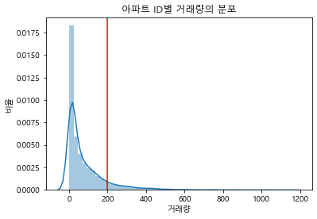

``` python
graph_2 = sns.distplot(apt_per['count']) # 그래프
graph_2.axvline(0, color='red') # 최소
graph_2.axvline(172, color='red') # 최대
plt.title('아파트 ID별 거래 없는 달의 분포')
plt.xlabel('결측치'); plt.ylabel('비율')
plt.show()
```

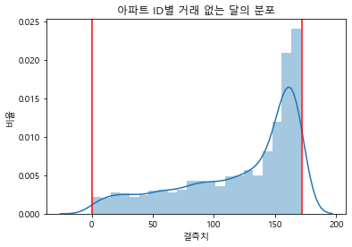

## 3\. Feature selecting & 데이터 분석

  - 클러스터링에 사용할 변수를 선택하기 위해 각 변수와 amount의 상관관계 파악에 중점을 두어 분석
  - 데이터의 분포와 값을 살펴보면서 데이터에 대한 이해 증진
  - 변수는 크게 5가지로 나누어 살펴볼 것

<!-- end list -->

``` python
# 시계열에만 사용될 변수를 제거하고 heatmap을 사용해 상관관계를 살펴보았다
temp = df.drop(['apartment_id','area','year','month'],axis=1)
figure,ax1 = plt.subplots()
figure.set_size_inches(10,10)

sns.heatmap(temp.corr(),annot=True,cmap='YlGnBu')
```

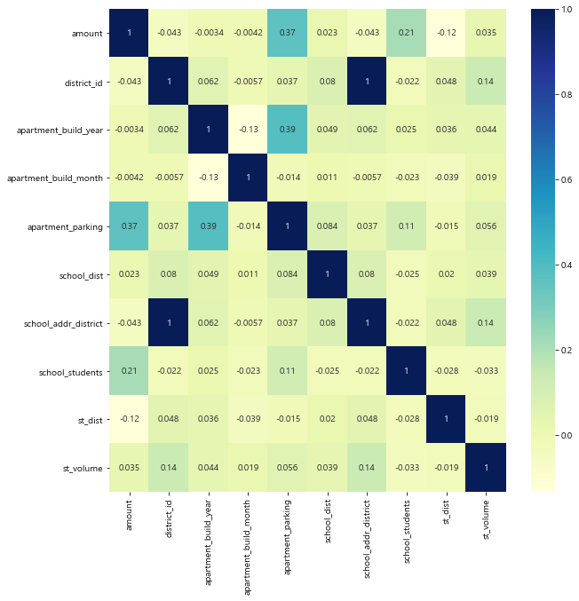

  - 수치상으로 세대당 주차대수, 학교 학생수, 지하철역과의 거리 변수가 상대적으로 실거래가와 높은 상관관계를 보인다
  - 각 변수별로 자세히 알아보자

### 1\) 연도별 거래액 및 면적

##### amount

  - 2009년도부터 2013년까지의 실거래가가 감소하나, 2013년도부터 실거래가 증가
    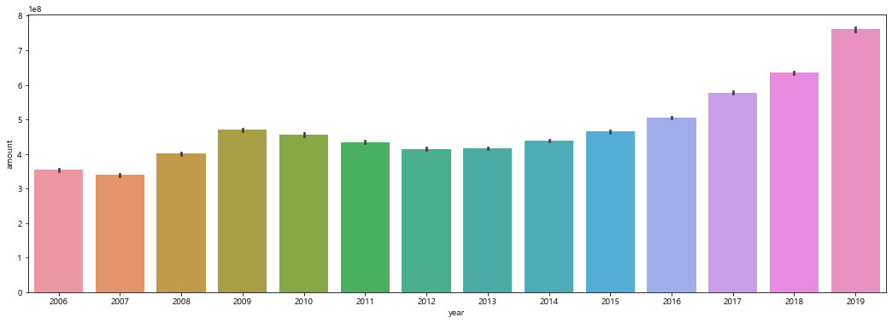

##### area

  - 면적이 300이상인 아파트들은 찾아보기 힘들다. 대부분 200 이하의 값을 갖는다
  - 면적이 400이상인 곳은 논현동, 도곡동, 방배동에 위치한 아파트다 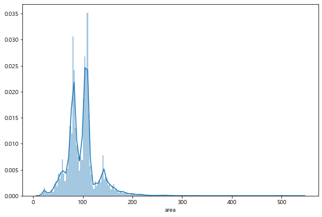

### 2\) 학교정보

  - 538개의 학교가 있으며, 초등학교 데이터만 존재

##### 학교 id

  - 명목형 변수의 경우(학교id,지하철id,건설사id) id에 따른 산포도를 그리고 그 값이 고르게 분포하지 않고 편중되어
    있을 경우, 그 변수가 클러스터링을 구분짓는 올바른 척도로 사용할 수 없다고 판단해 제거  
  - 학교 id에 따른 2019년도의 거래가를 구해서 분포를 살펴보니, 가격의 분포가 5억을 중심으로 정규분포에 근사하며 학교에
    따라 다양한 값을 가짐

<!-- end list -->

``` python
sample = df[df['school_students']>0]
sample = sample.groupby(['school_name','year'])['amount'].mean().reset_index()
sample_2019 = sample[sample['year']==2019]
sample_2019.head()
```

``` python
figure,(ax1,ax2) = plt.subplots(nrows=1,ncols=2)
figure.set_size_inches(18,6) 


sns.scatterplot(sample_2019['school_name'],sample_2019['amount'],ax=ax1)
sns.kdeplot(sample_2019['amount'],ax=ax2)
```

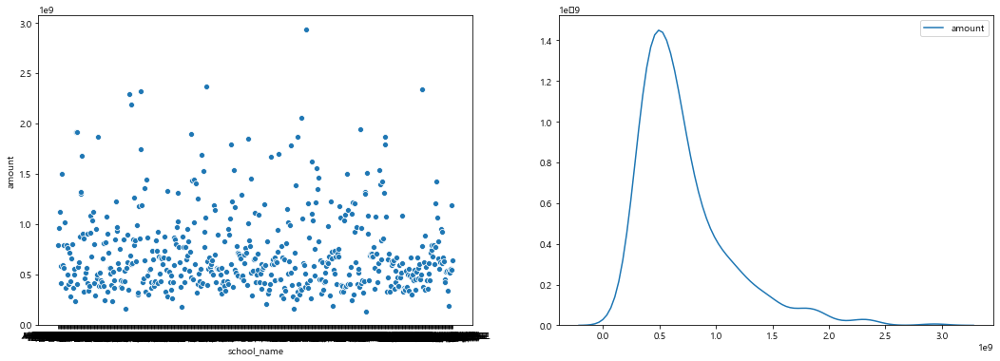

##### school\_addr

  - 학교 자치구 주소가 아파트의 주소와 값이 모두 동일하므로 제거

##### school\_dist

  - 아파트에서 가장 가까운 학교까지의 거리(분단위)

<!-- end list -->

``` python
figure,ax1 = plt.subplots()
figure.set_size_inches(12,6) 

sns.boxplot(x="school_dist",y="amount",data=df,color="m",ax=ax1)
```

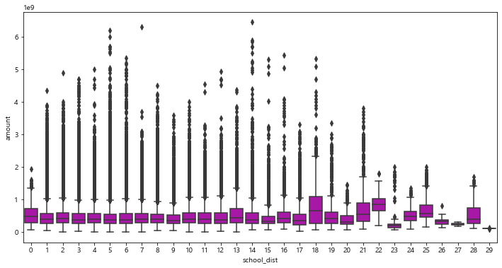

  - 아파트에서 학교까지의 거리에 따라 실거래가는 큰 차이를 보이지 않는다. 특히 17분 이하의 경우에는 거의 동일한 box
    plot을 가지므로 제거
  - heatmap의 0.023 수치에서도 확인 가능

##### school\_students

  - 자치구별 세대수 인구를 구하고 세대수 대비 학교 학생 수의 비율을 구하였다
    <div>
    <style scoped>
      .dataframe tbody tr th:only-of-type {
          vertical-align: middle;
      }
    
      .dataframe tbody tr th {
          vertical-align: top;
      }
    
      .dataframe thead th {
          text-align: right;
      }
    </style>
    <table class="dataframe">
    <thead>
    <tr style="text-align: right;">
    <th>
    </th>
    <th>
    district\_name
    </th>
    <th>
    세대수
    </th>
    </tr>
    </thead>
    <tbody>
    <tr>
    <th>
    3
    </th>
    <td>
    종로구
    </td>
    <td>
    73947
    </td>
    </tr>
    <tr>
    <th>
    4
    </th>
    <td>
    중구
    </td>
    <td>
    62739
    </td>
    </tr>
    <tr>
    <th>
    5
    </th>
    <td>
    용산구
    </td>
    <td>
    110126
    </td>
    </tr>
    <tr>
    <th>
    6
    </th>
    <td>
    성동구
    </td>
    <td>
    135838
    </td>
    </tr>
    <tr>
    <th>
    7
    </th>
    <td>
    광진구
    </td>
    <td>
    164428
    </td>
    </tr>
    </tbody>
    </table>
    </div>

<div>

<style scoped>
    .dataframe tbody tr th:only-of-type {
        vertical-align: middle;
    }

    .dataframe tbody tr th {
        vertical-align: top;
    }

    .dataframe thead th {
        text-align: right;
    }
</style>

<table class="dataframe">

<thead>

<tr style="text-align: right;">

<th>

</th>

<th>

index

</th>

<th>

school\_name

</th>

<th>

school\_students

</th>

<th>

amount

</th>

<th>

district\_name

</th>

<th>

세대수

</th>

<th>

ratio

</th>

</tr>

</thead>

<tbody>

<tr>

<th>

0

</th>

<td>

0

</td>

<td>

서울가곡초등학교

</td>

<td>

879.0

</td>

<td>

4.794164e+08

</td>

<td>

강서구

</td>

<td>

262708

</td>

<td>

0.003346

</td>

</tr>

<tr>

<th>

1

</th>

<td>

562

</td>

<td>

서울가동초등학교

</td>

<td>

947.0

</td>

<td>

6.759128e+08

</td>

<td>

송파구

</td>

<td>

278711

</td>

<td>

0.003398

</td>

</tr>

<tr>

<th>

2

</th>

<td>

1769

</td>

<td>

서울가락초등학교

</td>

<td>

812.0

</td>

<td>

7.367314e+08

</td>

<td>

송파구

</td>

<td>

278711

</td>

<td>

0.002913

</td>

</tr>

<tr>

<th>

3

</th>

<td>

1984

</td>

<td>

서울가양초등학교

</td>

<td>

235.0

</td>

<td>

3.622789e+08

</td>

<td>

강서구

</td>

<td>

262708

</td>

<td>

0.000895

</td>

</tr>

<tr>

<th>

4

</th>

<td>

2738

</td>

<td>

서울가원초등학교

</td>

<td>

630.0

</td>

<td>

1.038202e+09

</td>

<td>

송파구

</td>

<td>

278711

</td>

<td>

0.002260

</td>

</tr>

</tbody>

</table>

</div>

  - ratio는 각 자치구별 세대수와 학교 학생수의 비율을 구한것

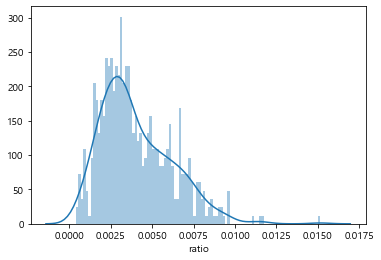

  - 비율은 0.00038과 0.015사이 , 0.015이상인 학교는 한 사례로 제거한다
  - 비율에 따른 실거래가 regplot을 그려보았다

<!-- end list -->

``` python
figure,ax1 = plt.subplots()
figure.set_size_inches(6,6) 

sns.regplot(x="ratio",y="amount",data=df1,color="m",ax=ax1)
```

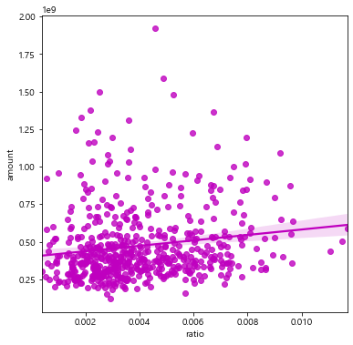

  - 비율이 커질수록 아파트의 실거래가가 높아진다 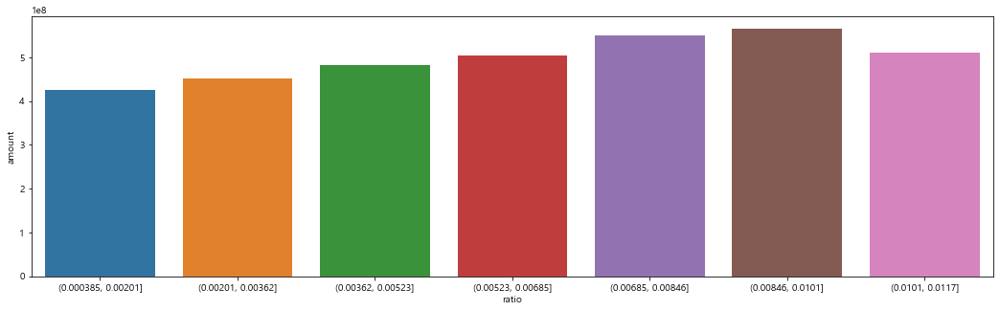

  - 구간별로 살펴보았을 때 자치구 세대수 인구 대비 학교 학생수의 비율이 커질수록, 실거래가 커지는 경향

### 3\) 세대당 주차대수 apartment\_parking

  - 세대당 주차대수는 0\~2대 사이에 주로 분포 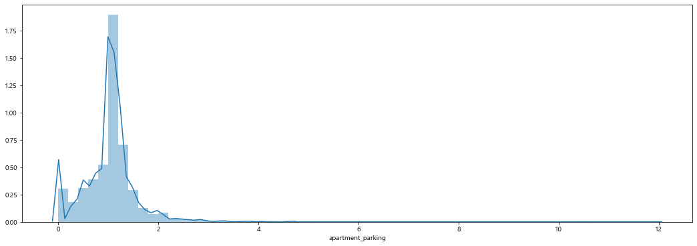

<!-- end list -->

``` python
figure,ax1 = plt.subplots()
figure.set_size_inches(18,5) 

sns.barplot(data=df,x="apartment_parking",y="amount",ax=ax1)
```

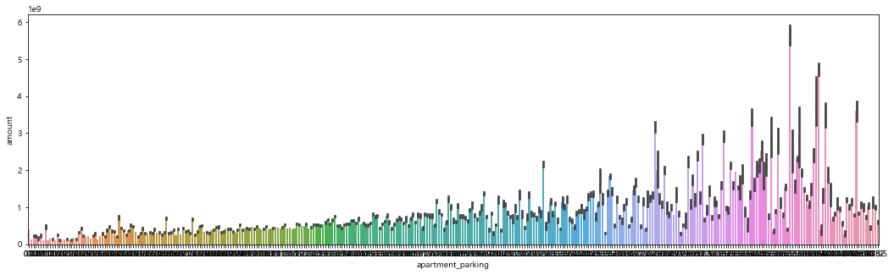 - 세대당 주차대수의 값이 커질수록 실거래가의 값이 점진적으로 우상향하는 것을
확인할 수 있다

### 4\) 건설

##### apartment\_building

  - 2520개의 건설사 존재
  - 건설사 id별 2019년도 평균 실거래가 분포를 살펴보았을 때, 10억 이하의 값으로 과도하게 편중되어 있으므로 제거

<div>

<style scoped>
    .dataframe tbody tr th:only-of-type {
        vertical-align: middle;
    }

    .dataframe tbody tr th {
        vertical-align: top;
    }

    .dataframe thead th {
        text-align: right;
    }
</style>

<table  class="dataframe">

<thead>

<tr style="text-align: right;">

<th>

</th>

<th>

apartment\_builder

</th>

<th>

year

</th>

<th>

amount

</th>

</tr>

</thead>

<tbody>

<tr>

<th>

3

</th>

<td>

((주)심원디엔씨)

</td>

<td>

2019

</td>

<td>

344000000.0

</td>

</tr>

<tr>

<th>

13

</th>

<td>

(유)25종합건설

</td>

<td>

2019

</td>

<td>

325000000.0

</td>

</tr>

<tr>

<th>

24

</th>

<td>

(유)동호에스제이종합개발

</td>

<td>

2019

</td>

<td>

280000000.0

</td>

</tr>

<tr>

<th>

32

</th>

<td>

(유)호원건설

</td>

<td>

2019

</td>

<td>

340000000.0

</td>

</tr>

<tr>

<th>

45

</th>

<td>

(조한종합)

</td>

<td>

2019

</td>

<td>

509999999.0

</td>

</tr>

</tbody>

</table>

</div>

``` python
figure,(ax1,ax2) = plt.subplots(nrows=1,ncols=2)
figure.set_size_inches(18,6) 

sns.scatterplot(sample_2019['apartment_builder'],sample_2019['amount'],ax=ax1)
sns.kdeplot(sample_2019['amount'],ax=ax2)
```

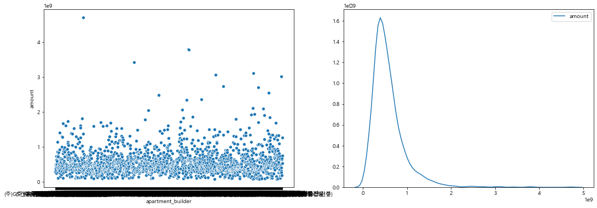

##### apartment\_build\_year

  - 1970, 2020년대에 지어진 아파트의 수가 적은거에 비해 실거래가의 평균이 높으며, 2000년대에 가장 아파트가 많이
    지어졌지만 낮은 실거래가의 값을 가짐

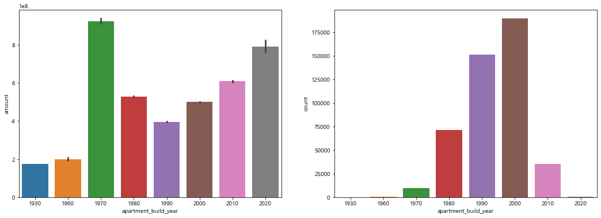

### 5\) 지하철역

##### st\_name

  - 각 지하철역 id에 따른 2019년도 거래가 평균을 살펴보았을 때, 가격의 분포가 역에 따라 다양한 값을 갖는다

<!-- end list -->

``` python
sample = df.groupby(['st_name','year'])['amount'].mean().reset_index()
sample_2019 = sample[sample['year']==2019]
sample_2019.head()
```

<div>

<style scoped>
    .dataframe tbody tr th:only-of-type {
        vertical-align: middle;
    }

    .dataframe tbody tr th {
        vertical-align: top;
    }

    .dataframe thead th {
        text-align: right;
    }
</style>

<table class="dataframe">

<thead>

<tr style="text-align: right;">

<th>

</th>

<th>

st\_name

</th>

<th>

year

</th>

<th>

amount

</th>

</tr>

</thead>

<tbody>

<tr>

<th>

13

</th>

<td>

4.19민주묘지역

</td>

<td>

2019

</td>

<td>

3.322311e+08

</td>

</tr>

<tr>

<th>

28

</th>

<td>

가락시장역

</td>

<td>

2019

</td>

<td>

1.131895e+09

</td>

</tr>

<tr>

<th>

43

</th>

<td>

가산디지털단지역

</td>

<td>

2019

</td>

<td>

3.877221e+08

</td>

</tr>

<tr>

<th>

58

</th>

<td>

가양역

</td>

<td>

2019

</td>

<td>

5.530393e+08

</td>

</tr>

<tr>

<th>

73

</th>

<td>

가오리역

</td>

<td>

2019

</td>

<td>

4.011351e+08

</td>

</tr>

</tbody>

</table>

</div>

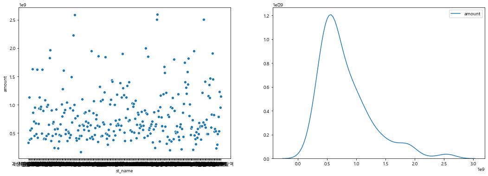

##### st\_volume

  - 환승역이 4개인 곳의 실거래가가 2014년도 이후부터 꾸준히 증가하며, 환승역의 개수 별 거래액이 큰 차이를 보이지 않는다
    \> 제거

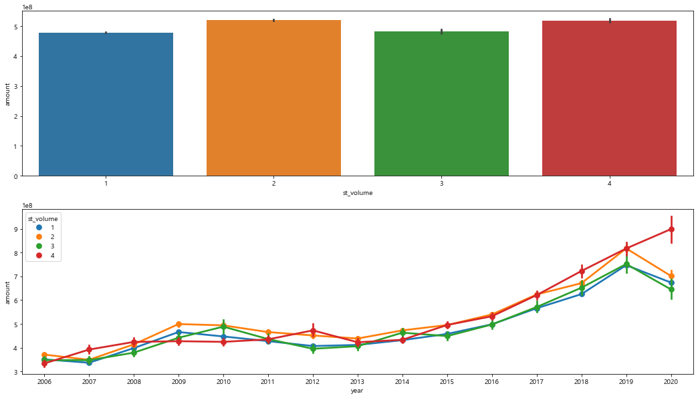

##### st\_dist

  - 지하철역까지의 거리가 0.0247 이하인 경우 거리가 가까울 수록 실거래가가 커지는 경향이었으나, 0.0247보다 큰
    경우에는 양의 상관관계를 보인다.

<!-- end list -->

``` python
factor = pd.cut(df.st_dist,7)
a = df.amount.groupby(factor).mean()
a = pd.DataFrame(a)
a = a.reset_index()

figure,ax1 = plt.subplots()
figure.set_size_inches(18,5) 

sns.barplot(data=a,x="st_dist",y="amount",ax=ax1)
```

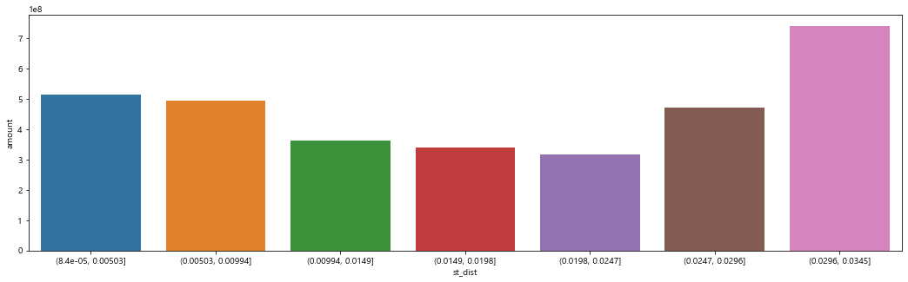

``` python
df[df['st_dist']>0.0296]['apartment_addr_town'].drop_duplicates()
```

  - 양의 상관관계에 해당하는 동네는 평창동임을 확인할 수 있었다

#### feature selecting

  - EDA를 거쳐 최종적으로 자치구별id, 행정동 id, 아파트 건축연도, 세대당 주차 대수, 학교id, 학교 학생수, 지하철
    id, 지하철역과의 거리 변수를 클러스터링에 사용하기로 결정
