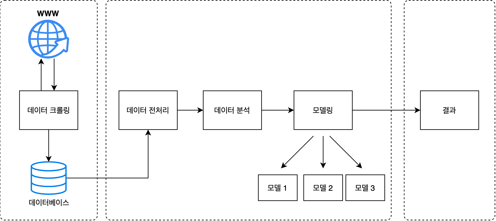

```{r setup, include=FALSE}
knitr::opts_chunk$set(echo = TRUE)
```

## Project Casa 시스템 구성



프로젝트 구성을 3단계로 나누었다.

----------

#### 1 단계: 데이터 수집

  - 아파트
  
    - 이번 프로젝트에 필요한 데이터들은 네이버 부동산 사이트에서 수집했다. (서울 지역으로 제한함)
    
    - 각 지역 아파트의 `단지정보`, `시세/실거래가`, `학군정보`를 찾아 데이터를 수집했다.
    
    - 모든 데이터를 크롤링한 후 데이터베이스에 삽입했다. (**PostgreSQL** 사용)

  - 지하철
    
    - 아파트의 위치에서 가장 가까운 지하철 역의 정보를 카카오 API를 통해 수집했다.
    
    - 각 아파트에서 유클리드 거리가 가장 가까운 지하철 역을 매칭했다.
    
    - 모든 데이터를 크롤링한 후 데이터베이스에 삽입했다. (**PostgreSQL** 사용)


#### 2 단계: 데이터 처리 및 모델링

  - EDA 과정에서 불필요하다고 판단한 변수를 제거했다.
  
  - 문자열 자료형을 모델링에 그대로 적용할 수 없기 때문에, 라벨 인코딩 함수를 활용하여 정수형 자료로 변형했다. 추후 편한 디코딩을 위해 인코더를 model 경로에 저장했다.
  
  - 연속형 자료형은 이상치에 Robust한 표준화 과정을 통해 모든 변수가 같은 스케일 안에서 반영될 수 있도록 했다. 추후 편한 인버스 스케일링을 위해 스케일러를 model 경로에 저장했다.
  
  - 모델링은 크게 결측치 보완을 위한 `클러스터링 파트`와 가격 예측을 위한 `시계열 예측 파트`로 구분된다. 


#### 3 단계: 결과

  - 쉘 스크립트를 작성해 터미널에서 사용할 수 있게 만들었다.
